# Filtration
________________
Our university project
Collaborators: 
- [Artem Medvedev](https://github.com/artiebears13)
- [Andrey Donskoy](https://github.com/Donskoy-Andrey) [(web-site)](www.donskow.com)
- [Timofey Schudro](https://github.com/TeeMan508)

## 1. Filtration model
_________

$\frac{\partial\phi\rho_wS_w}{\partial t} - div(\lambda_w\mathbb{K}(\nabla\rho_w - \rho_wg\nabla z)) = q_w$ - equation for water

$\frac{\partial\phi\rho_oS_w}{\partial t} - div(\lambda_o\mathbb{K}(\nabla\rho_o - \rho_og\nabla z)) = q_o$ - equation for oil

$S_w + S_o = 1$ (both liquids fill all pores)

$p_w = p_o - P_{cow}(S_w)$ (Capillar presure)

$\lambda_{\alpha}(S_w, p_o) = \frac{\rho_{\alpha}(p_o)k_{r\alpha}(S_w)}{\mu_{\alpha}(p_o)}$, $\alpha=w, o$ - mobility for every phase

$\rho_{\alpha} = \rho_{\alpha}^s/B_{\alpha}(p_o)$ (liquid density, $\rho_{\alpha}^s$ - surface density)

$B_{\alpha}$ (volumetric compression factor, from tables)

$k_{r\alpha} = S_{\alpha}^n$ (relative phase permeabilities, from tables)

$\mu_{\alpha}$ (phase viscosities, from tables)

$\mathbb{K}$ (absolute permeability tensor)

$\phi = \phi_0 + \phi_0C_r(p - p_{ref})$ (porosity)

We used a ready-made filtration model from [INM RAS](https://www.inm.ras.ru/en/)

## Model results:

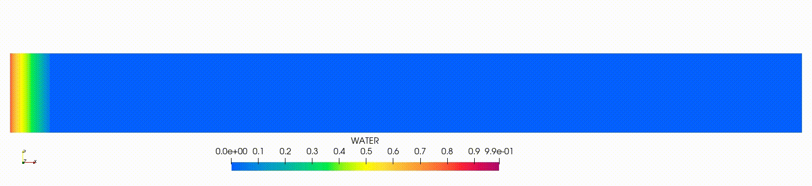

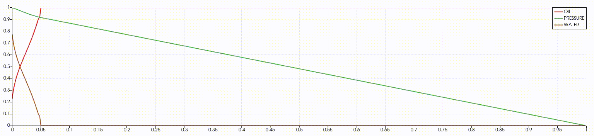

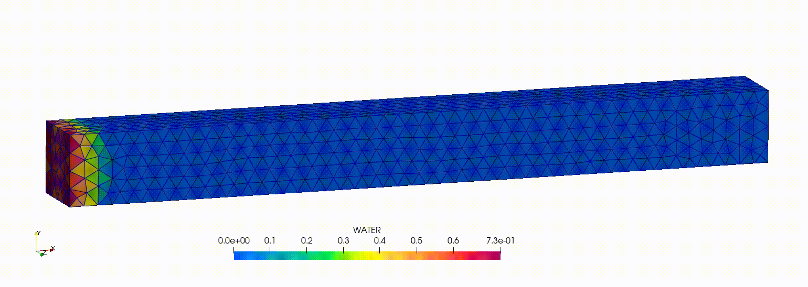

# Main Projects:
_____
## Finding the Fracture Position

The task is to determine the coordinates of the fracture based on the flow rate

**Area dimensions: 1 m by 2 m**

**Accounting time: 20 days**

**Wells:**
- 4500 psi bottom hole pressure, discharge
- 3100 psi bottom hole pressure, producing
- Radius: 0.005 feet

Filtration with fracture:

In this case we used [Hyperopt optimizator](http://hyperopt.github.io/hyperopt/)

Code [here](./Fracture/frac_main)

## Results:

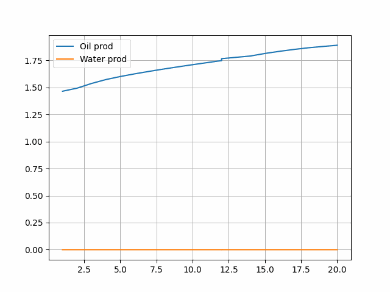

### Accuracy:

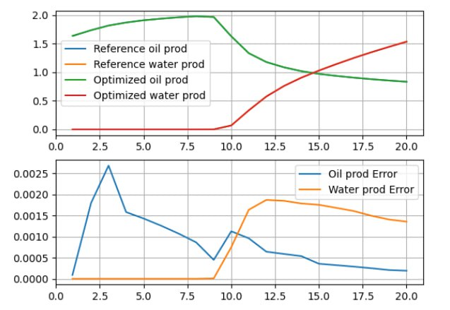

_____

## Finding the optimal well

The task is to select the position of the producing well with a fixed injection well so that the resulting combination gives the maximum flow rate.

Area Dimensions: 100 by 100 feet

Depth: 4000 to 4010 feet

Initial pressure: 4000 psi, oil saturation 0.85

Wells:
- 5000 psi bottom hole pressure, discharge
- 1500 psi bottom hole pressure, producing
- Radius: 0.005 feet

Accounting time: 365 days

Input: 20x20x1 segments from SPE10
(geological model of a real deposit)

Input data example:

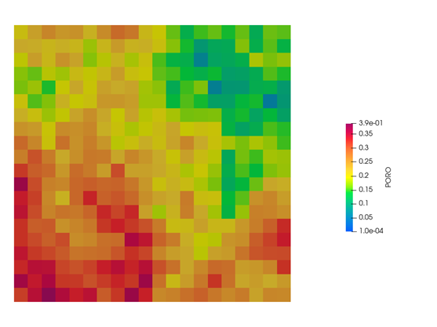

Steps:

1. We generated data for models: production for every prod well posision
2. Generated data: best position for every sample using hyperopt
3. Trained gradient boosting model ["CatBoost"](https://catboost.ai/) for prediction of all production in every cell.
4. We trained a fully connected neural network model with data, got from optimizer .

Hyperopt searching optimal well position:
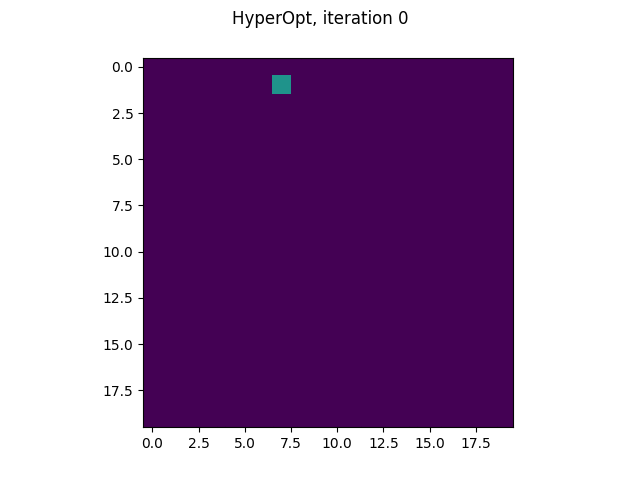

## CatBoost Results:
- MAE: 

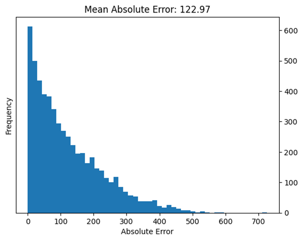

- Prediction example

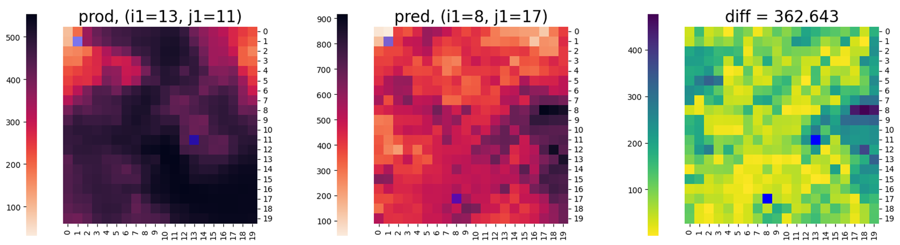

## Neural Network:

- Error

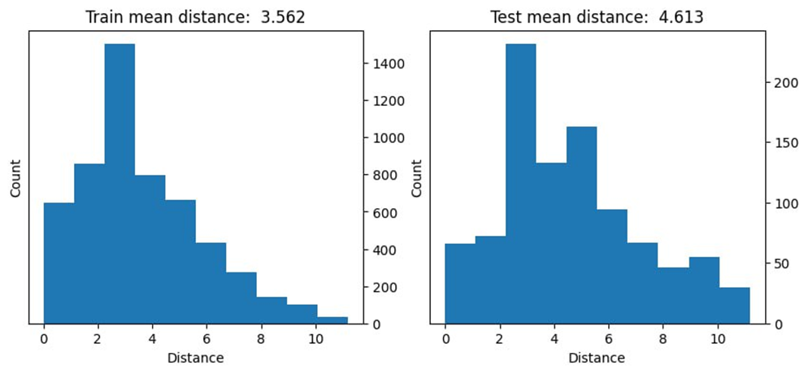

- Prediction example

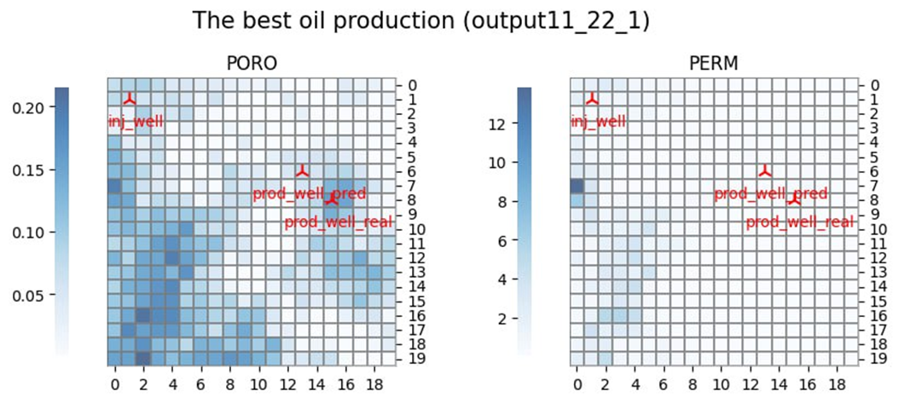

